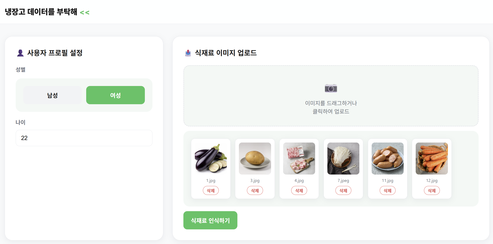
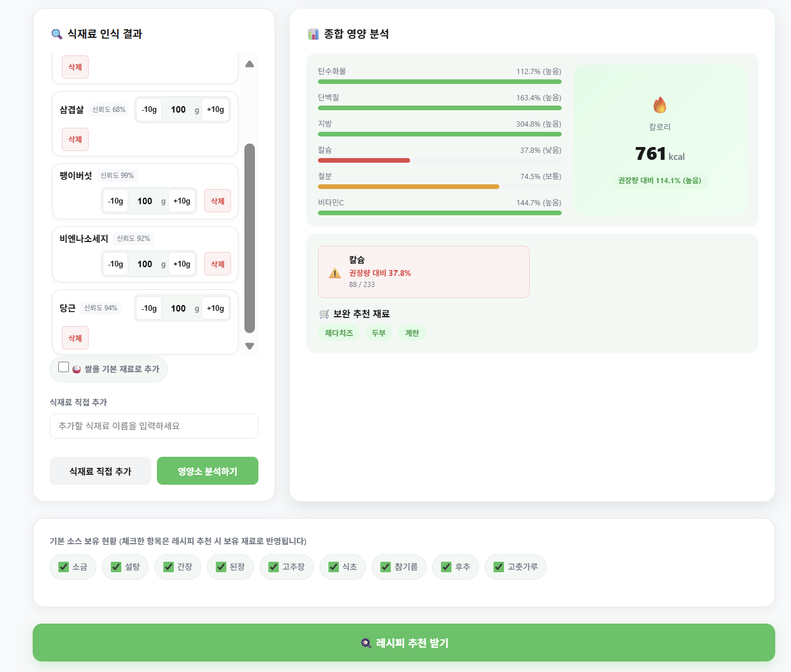
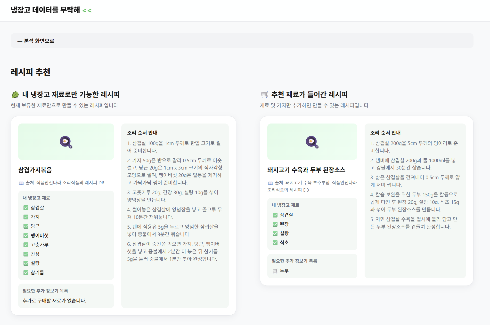
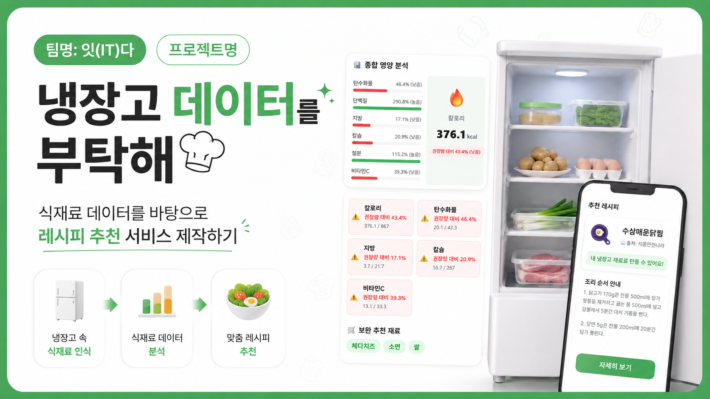

# 🥬 최종보고서

> **팀명**: 잇(IT)다 | **프로젝트명**: 냉장고 데이터를 부탁해 — 식재료 데이터를 바탕으로 레시피 추천 서비스 제작하기

## 목차

- [1. 프로젝트 소개](#1-프로젝트-소개)
- [2. 상세설계](#2-상세설계)
- [3. 개발결과](#3-개발결과)
- [4. 설치 및 사용 방법](#4-설치-및-사용-방법)
- [5. 소개 및 시연 영상](#5-소개-및-시연-영상-pc버전과-모바일버전)
- [6. 팀 소개](#6-팀-소개)
- [7. 해커톤 참여 후기](#7-해커톤-참여-후기)
- [8. 참고문헌 및 출처](#8-참고문헌-및-출처)

### 1. 프로젝트 소개

#### 1.1. 개발배경 및 필요성

통계청에 따르면 국내 1인 가구 비중은 2024년 기준 전체 가구의 35%를 넘었다. 1인 가구의 확산과 함께 식생활 문제도 심화되고 있는데, 1인 가구는 소량의 식재료를 구매하고도 냉장고 속 식재료를 잊어버려 낭비하거나 "무엇을 해먹을지 모르겠다"는 이유로 배달음식에 과도하게 의존하는 경향이 있다. 또한 건강에 대한 관심이 높아진 MZ세대를 중심으로 식단 내 영양소를 직접 관리하고자 하는 수요가 늘었지만, 기존 레시피 추천 서비스는 식재료를 일일이 텍스트로 입력해야 하거나 영양소 분석과 레시피 추천 기능이 분리되어 있어 사용자가 여러 서비스를 오가야 하는 불편함이 있다.

데이터 분석의 신뢰도를 위해 식품의약품안전처의 식품안전나라 식품영양성분 데이터베이스, 보건복지부·한국영양학회의 한국인 영양소 섭취기준(KDRIs), 농촌진흥청 국립식량과학원의 농식품 식단관리(메뉴젠) 조리정보, AI Hub의 한국 식재료 이미지 데이터셋 등 공공데이터를 기반으로 삼아 분석의 객관성과 모델·레시피 추천의 신뢰도를 함께 확보하고자 하였다.

#### 1.2. 개발목표 및 주요내용

냉장고 속 식재료를 개별 촬영한 사진 여러 장을 업로드하면, 전이학습 모델이 각 식재료를 자동 분류하고 공공 영양소 DB와 연동하여 영양 정보를 보여주며, 공공 레시피 데이터를 검색·근거로 삼는 RAG 구조의 생성형 AI가 레시피를 추천하는 통합 웹 서비스를 개발하는 것을 최종 목표로 하였으며, 최종적으로 아래 4가지 기능을 갖춘 서비스로 완성하였다.

- **식재료 이미지 분류**: EfficientNetB0 기반 전이학습 모델로 사진 속 식재료 20종을 자동 인식 (Top-3 신뢰도 포함, TFLite 경량화 적용)
- **실제 섭취량(g) 기반 영양소 분석**: 식품안전나라 공공 DB와 KDRI 기준 대비 부족한 영양소(칼로리·단백질·비타민 등)를 재료별 실제 섭취량(g) 기준으로 정밀 분석하고 보완 식재료를 추천
- **RAG 기반 레시피 추천**: 농촌진흥청·식품안전나라의 실제 레시피 1,246건을 임베딩한 FAISS 벡터 인덱스에서 보유 재료와 관련된 레시피를 검색한 뒤, 검색 결과를 근거로 Gemini가 "보유 재료 우선" / "영양 보완" 레시피를 생성하고 실제 참고 출처를 함께 제시
- **모바일 대응 UI**: 카메라 촬영 연동, 재료별 섭취량(g) 직접 조절 등 모바일 환경 사용성 개선

#### 1.3. 세부내용

**요구사항 분석**

사용자는 프로필(성별·나이)을 입력한 뒤 냉장고 속 식재료를 하나씩 촬영한 여러 장의 이미지를 웹 페이지에 업로드한다(모바일 환경에서는 `capture` 속성을 활용해 카메라로 바로 촬영 가능). 업로드된 이미지는 전이학습 기반 이미지 인식 모델을 통해 식재료를 자동 식별해 목록으로 만들고, 잘못 인식된 식재료나 추가해야 할 식재료가 있다면 직접 추가/삭제할 수 있으며, 재료별 실제 섭취량(g)도 직접 조절할 수 있다. 확정된 식재료 목록은 [분석 시작] 버튼을 눌러야 영양 분석이 진행되며, 식품안전나라 데이터와 연계해 칼로리·탄수화물·단백질·지방·칼슘·철분·비타민C 등 영양 정보를 재료별 실제 섭취량(g) 기준으로 환산해 표와 그래프로 제공한다. 이후 [추천 시작] 버튼을 통해 보유 식재료와 부족 영양소를 RAG 파이프라인에 전달하여, 관련 공공 레시피를 먼저 검색하고 이를 근거로 생성한 "내 냉장고 재료만으로 가능한 레시피"와 "부족 영양소가 보완된 레시피" 2가지를 추천 근거(출처)와 함께 제공한다.

**개발 환경**

Python을 기본 언어로 사용하며 딥러닝 모델 학습은 TensorFlow/Keras와 Google Colab GPU 환경에서 진행하였다. 웹 백엔드는 FastAPI, 프런트엔드는 순수 HTML/CSS/JavaScript로 구현하였으며, 레시피 생성에는 Gemini API를, 레시피 검색에는 Sentence-Transformers 임베딩과 FAISS 벡터 인덱스를 사용하였다. 코드 협업과 보고서 제출은 GitHub(GitHub Classroom)를 통해 진행하였고, 개발 전 과정에서 Claude Code·GitHub Copilot 등 AI 코딩 도구와 Claude·ChatGPT·Gemini 등 생성형 AI를 코드 작성, 디버깅, 기능 구현에 적극 활용하였다.

**제한사항 및 대책**

- **LLM 할루시네이션**: LLM이 현실성이 낮은 조리법을 제안하거나 보유하지 않은 식재료를 필수 재료로 포함하는 문제가 있어, 프롬프트 규칙으로 "보유 재료와 기본 양념(물·소금·후추·식용유)만 필수 재료로 가정하고, 밥·면·빵은 추가 재료로 분류하며 보유하지 않은 재료를 필수 재료로 만들지 않는다"는 지침을 명시하였다. LLM 응답은 Pydantic 스키마로 강제 검증하여 규칙 위반 시 재시도하도록 설계하였고, RAG 도입 이후에는 여기에 더해 (1) LLM이 인용한 출처가 실제 검색 문서 목록에 있는지, (2) 인용한 문서와 생성된 레시피의 주재료(단백질류 우선)가 실제로 겹치는지까지 함께 검증해 "출처는 있지만 내용은 무관한" 레시피가 통과되지 않도록 강화하였다.
- **서비스 중단 방지**: LLM API 타임아웃·파싱 실패·빈 응답, 벡터 검색 실패(로컬 인덱스 손상 등) 상황에서는 기존 LLM 직접 생성 방식 또는 고정 Mock 응답으로 순차 자동 폴백(fallback)하도록 구현해 서비스 중단을 방지하였다.
- **배포 환경 메모리 제약**: 무료 클라우드 배포 환경(Render Free, RAM 512MB)에서 TensorFlow 풀 모델 로딩·추론 시 메모리 한도를 초과해 인스턴스가 재시작되는 문제가 발생하여, `.keras` 모델을 TFLite(float16 양자화)로 변환해 추론 경로를 경량화하였다(정확도 손실은 confidence 차이 0.001 미만 수준으로 무시할 수준). 자세한 내용은 [`docs/deploy_guide.md`](docs/deploy_guide.md) 참고.

#### 1.4. 기존 서비스(상품) 대비 차별성

기존 식재료·레시피 서비스는 사용자가 보유 식재료를 직접 입력·선택해야 하는 번거로움이 있고, 범용 이미지 인식 모델을 사용해 한국 고유 식재료의 인식 정확도가 낮으며, 영양 분석과 레시피 추천 기능이 분리되어 있어 여러 서비스를 함께 이용해야 하는 한계가 있다. 또한 생성형 AI 기반 레시피 서비스는 실제 근거 없이 레시피를 지어내는 경우가 많아 신뢰하기 어렵다.

본 프로젝트는 AI Hub의 한국 식재료 이미지 공공 데이터셋으로 EfficientNetB0을 직접 전이학습시켜 20종의 한국 식재료를 96.7%의 테스트 정확도로 분류하는 자체 모델을 구축하였고, 텍스트 입력 대신 사진을 여러 장 한 번에 업로드해 일괄 인식하는 다중 이미지 처리 기능을 제공한다. 여기에 식품안전나라 공공 영양성분 데이터 기반의 실제 섭취량(g) 반영 영양소 분석과, 농촌진흥청·식품안전나라의 실제 공공 레시피 1,246건을 검색·인용하는 RAG 기반 레시피 추천을 하나의 웹 서비스에 통합하였다. 이를 통해 별도 앱 설치 없이 브라우저에서 식재료 인식부터 근거 있는 레시피 확인까지 전 과정을 한 번에, 그리고 "왜 이 레시피를 추천했는지" 출처와 함께 경험할 수 있도록 하였다.

#### 1.5. 사회적가치 도입 계획

1인 가구 및 자취생의 식재료 낭비와 불균형한 식생활 문제를 데이터 기반으로 완화하는 것을 사회적 가치의 핵심으로 삼는다. 프로젝트 기간 동안 실제 클라우드 배포(Render)를 시도하며 무료 인프라에서의 운영 제약(메모리 한도, 콜드 스타트 등)을 직접 확인하고 TFLite 경량화 등 개선을 적용한 경험을 바탕으로, 향후 지역사회·대학 커뮤니티 대상 시범 서비스를 통해 실제 사용성을 검증하고 실제 배포 가능한 수준으로 발전시키는 것을 목표로 한다. 별도의 앱 설치 없이 브라우저에서 바로 이용할 수 있는 구조이기 때문에, 자취생·1인 가구가 접근 장벽 없이 식재료 낭비 절감과 균형 잡힌 식생활 실천에 실질적으로 활용할 수 있는 서비스로 확장하는 것을 사회적 활용 방안으로 삼는다.

### 2. 상세설계

#### 2.1. 시스템 구성도

```
[프런트엔드: HTML/CSS/JS]
  ├─ 프로필 입력 · 이미지 업로드(카메라 연동) · 인식 결과 수정 · 섭취량(g) 조절
  ├─ 영양 분석 결과 렌더링
  └─ 레시피 카드 렌더링 (출처 표시)
        │  (REST API, JSON)
        ▼
[백엔드: FastAPI (main.py)]
  ├─ routers/health.py        — 서버 상태 확인
  ├─ routers/ingredients.py   — 이미지 인식 · 재료명 검색 요청 처리
  ├─ routers/profile.py       — 프로필 기반 권장 섭취량 조회
  ├─ routers/nutrition.py     — 영양 분석 요청 처리 (serving_g 반영)
  └─ routers/recipes.py       — RAG 기반 레시피 추천 요청 처리
        │
        ▼
[서비스 계층]
  ├─ image_service.py       — EfficientNetB0(TFLite) 모델 로드·추론 (Top-3 신뢰도)
  ├─ nutrition_service.py   — 영양 성분 조회 · serving_g 반영 충족률 계산
  ├─ recipe_retriever.py    — Sentence-Transformers 임베딩 + FAISS 벡터 검색, 재료 매칭 스코어링
  ├─ rag_recipe_service.py  — 검색 결과 기반 프롬프트 구성, Gemini 호출, 출처·재료 겹침 검증, 검색 캐싱
  └─ llm_recipe_service.py  — Gemini API 직접 호출(RAG 실패 시 fallback), Mock fallback
        │
        ▼
[데이터 계층]
  ├─ model/artifacts/ingredient_model_v2.keras·tflite, class_names_v2.json (20종)
  ├─ data/nutrition.csv, kdri.csv, ingredient_aliases.json
  ├─ data/recipe_corpus/recipes.jsonl (1,246건) + index/ (FAISS 인덱스, 1,260 청크)
  └─ backend/mock/recipe_mock.json (LLM 실패 시 최종 폴백)
```

전체 흐름은 "프로필 입력 → 이미지 업로드 → 식재료 인식 → 인식 결과 수정/보완(재료·섭취량) → 영양 분석 → (벡터 검색 →) 레시피 추천"의 순서로 진행되며, 각 단계는 사용자가 직접 트리거(분석 시작·추천 시작 버튼)하는 구조로 설계하였다. 레시피 추천은 항상 RAG 검색을 우선 시도하고, 검색 결과가 없거나 실패하면 LLM 직접 생성으로, 그마저 실패하면 Mock 응답으로 단계적으로 폴백한다.

#### 2.3. 사용기술

| 이름 | 버전 / 비고 |
| --- | --- |
| Python | 3.x |
| FastAPI | 백엔드 API 서버 |
| Uvicorn | ASGI 서버 |
| Pydantic | 요청/응답 스키마 검증 |
| TensorFlow / Keras | EfficientNetB0 전이학습 (모델 학습용) |
| ai-edge-litert | TFLite 경량 모델 추론 (배포/서빙용) |
| Google Colab (GPU) | 모델 학습 환경 |
| HTML / CSS / JavaScript | 프론트엔드 (프레임워크 없이 Vanilla JS) |
| Gemini API | LLM 레시피 생성 (RAG 근거 기반 + 직접 생성 fallback) |
| Sentence-Transformers | `paraphrase-multilingual-MiniLM-L12-v2`, 레시피 임베딩(384차원) |
| FAISS | `IndexFlatIP`, 레시피 벡터 검색(1,260 청크) |
| pytest | 단위/통합 테스트 (영양 계산, 이미지 서비스, 레시피 응답, API 통합) |
| Docker | 배포용 이미지 빌드 (`Dockerfile`, `.dockerignore`) |
| Render | 클라우드 배포 시도 (Public Git Repository 방식) |
| GitHub / GitHub Classroom | 협업 및 코드·보고서 관리 |
| Claude Code, GitHub Copilot, ChatGPT, Gemini | AI 코딩 및 기획 보조 도구 |

### 3. 개발결과

#### 3.1. 전체시스템 흐름도

1. **프로필 입력** — 성별 토글, 나이 입력 → 개인 맞춤 하루 권장 섭취량 계산 기준 확정
2. **이미지 업로드** — 식재료를 개별 촬영한 이미지 여러 장을 다중 업로드(jpg/jpeg/png), 모바일에서는 카메라로 즉시 촬영 가능
3. **식재료 자동 인식** — EfficientNetB0(TFLite) 모델이 이미지별 Top-3 후보와 신뢰도 반환 (20종 인식)
4. **인식 결과 확인·수정** — [+ 직접 추가]로 누락 재료 보완, 재료별 실제 섭취량(g) 조절(기본 100g, 1~2000g), 삭제 시 사진·인식결과 동기화 삭제
5. **영양 분석** — [분석 시작] 클릭 시 재료별 실제 섭취량(g)을 반영해 영양 성분을 계산하고 KDRI 대비 충족률(%)을 산출, 부족 영양소 경고 및 보완 식재료 후보 제시
6. **레시피 검색·추천** — [추천 시작] 클릭 시 보유 재료로 FAISS 벡터 인덱스에서 관련 공공 레시피를 검색(Top-5) → 검색 결과를 근거로 Gemini가 "내 냉장고 재료만으로 가능한 레시피"와 "영양소 보완 레시피"를 생성하고, 실제 참고한 레시피명·출처를 함께 제공

#### 3.2. 기능설명





| 기능 | 설명 |
| --- | --- |
| 성별·나이 입력 | 서비스 첫 진입 시 성별 토글과 나이 입력으로 개인 맞춤 권장 섭취량 계산 기준을 설정 |
| 식재료 자동 인식 + 신뢰도 표시 | 업로드한 사진마다 재료명과 신뢰도를 함께 표시 (20종 인식, 감자·당근·양배추·토마토·가지·파프리카·돼지고기·닭고기·양파·계란·마늘·두부·치즈·소면·팽이버섯·대파·비엔나소세지·참치캔·오이·김치) |
| 모바일 카메라 촬영 연동 | `<input type="file" capture="environment">`를 활용해 모바일에서 바로 카메라 촬영 가능 |
| 재료별 섭취량(g) 조절 | 재료마다 실제 보유·섭취량(g)을 기본값 100g에서 직접 조절(1~2000g), 범위를 벗어나면 서버에서 100g으로 자동 보정 |
| 식재료별 영양 성분 조회 | 재료별 실제 섭취량(g) 기준으로 환산한 칼로리·탄수화물·단백질·지방·칼슘·철분·비타민C를 표로 제공 |
| 부족 영양소 경고 및 보완 재료 추천 | KDRI 대비 충족률이 낮은 영양소를 경고 표시하고 보완 가능한 식재료 후보를 제시 |
| 식재료 삭제 | 업로드 사진 목록과 인식 결과 카드 중 어느 쪽에서 삭제해도 동일 재료가 양쪽에서 함께 삭제 |
| 식재료 직접 추가 | 인식되지 않았거나 잘못 인식된 재료(예: 쌀 등)를 텍스트로 직접 추가 |
| RAG 기반 레시피 검색·추천 | 보유 재료로 FAISS 벡터 인덱스에서 실제 공공 레시피(농촌진흥청·식품안전나라)를 검색하고, 검색 결과를 근거로 레시피를 생성 |
| 레시피 출처 표시 | 각 추천 레시피가 실제로 참고한 레시피명과 공공데이터 출처를 함께 표시해 신뢰도 확보 |
| 보유/추가 필요 재료 구분 | 레시피에 필요한 재료를 보유 재료(✅)/추가 필요 재료(🛒)로 구분해 제공 |
| 레시피 상세·조리 단계 안내 | 단계별 조리 순서를 리스트로 제공 |

#### 3.3. 기능명세서

| API | 메서드/경로 | 설명 |
| --- | --- | --- |
| 서버 상태 확인 | GET /api/health | `{"status": "ok"}` 반환 |
| 식재료 인식 | POST /api/ingredients/predict | 이미지(multipart) 업로드 → `{results: [{image_id, name, confidence, candidates, error}]}` 반환 (20종 모델, alias 매핑으로 한글명 변환) |
| 식재료 검색 | GET /api/ingredients/search?query= | 별칭 사전 기반 문자열 포함 검색 후보 반환 |
| 권장 섭취량 조회 | POST /api/profile/recommendations | `{gender, age}` → KDRI 그룹별 권장 섭취량 반환 (지원 범위 19~49세, 범위 밖/미입력 시 400) |
| 영양 분석 | POST /api/nutrition/analyze | `{profile, ingredients: [{ingredient_id, name, serving_g}]}` → `{per_ingredient, summary(nutrient별 충족률), deficient_supplements}` 반환. `serving_g`는 생략 시 100g, 1~2000g 범위를 벗어나면 서버에서 100g으로 자동 대체 |
| 레시피 추천 | POST /api/recipes/recommend | `{ingredients, deficient_nutrients, mode}` → `{recipe_mode, recipes:[{recipe_id, title, owned_ingredients, additional_ingredients, steps, sources:[]}]}` 반환. FAISS 검색 → Gemini 생성 순으로 처리하며, 검색 실패/결과 없음/생성 반복 실패 시 LLM 직접 생성으로, 그마저 실패 시 Mock으로 순차 폴백 |

공통 오류는 `{code, message, details}` 형태로 통일하여 반환한다 (예: `INVALID_PROFILE`, `NO_IMAGES`, `EMPTY_QUERY`, `INVALID_RECIPE_REQUEST`, `RECIPE_GENERATION_FAILED`).

#### 3.4. 디렉토리 구조

```
project/
├── frontend/
│   ├── index.html
│   ├── css/style.css
│   └── js/
│       ├── state.js        # 전역 상태 관리 (섭취량 g 필드 포함)
│       ├── upload.js       # 이미지 업로드·카메라 촬영·인식 결과 처리
│       ├── nutrition.js    # 영양 분석 화면
│       ├── recipes.js      # 레시피 추천 화면 (출처 표시)
│       ├── app.js          # 초기화·공통 오류 처리
│       └── api.js          # 백엔드 API 호출
├── backend/
│   ├── main.py              # FastAPI 앱, 라우터 등록, 공통 예외처리
│   ├── config.py            # 환경설정 (.env 로드)
│   ├── services/
│   │   ├── image_service.py       # TFLite 모델 로드·추론
│   │   ├── nutrition_service.py   # serving_g 반영 영양 계산
│   │   ├── llm_recipe_service.py  # Gemini 직접 생성 + Mock fallback
│   │   ├── recipe_retriever.py    # 임베딩·FAISS 검색, 재료 매칭 스코어링
│   │   ├── recipe_indexer.py      # 레시피 코퍼스 임베딩·인덱스 생성
│   │   ├── recipe_collector.py    # 공공 API 레시피 수집·정규화
│   │   └── rag_recipe_service.py  # RAG 프롬프트 구성, 출처 검증, 캐싱
│   ├── routers/
│   │   ├── health.py
│   │   ├── ingredients.py
│   │   ├── profile.py
│   │   ├── nutrition.py
│   │   └── recipes.py
│   ├── schemas/
│   │   └── recipe.py
│   └── mock/
│       └── recipe_mock.json
├── model/
│   ├── notebooks/train_efficientnet_v2.ipynb
│   ├── artifacts/ingredient_model_v2.keras, ingredient_model_v2.tflite, class_names_v2.json
│   ├── convert_to_tflite.py
│   └── evaluation/
├── data/
│   ├── nutrition.csv, kdri.csv, ingredient_aliases.json
│   └── recipe_corpus/
│       ├── recipes.jsonl        # 정규화된 레시피 1,246건
│       └── index/                # FAISS 인덱스, 청크, 설정
├── tests/
│   ├── test_nutrition.py
│   ├── test_image_service.py
│   ├── test_api_integration.py
│   ├── test_recipes.py
│   └── services/test_llm_recipe_service.py
├── docs/
│   ├── api_contract.md
│   ├── rag_design.md, rag_data_sources.md
│   ├── model_v2_plan.md
│   ├── gram_feature_design.md, mobile_gram_design.md
│   ├── nutrition_data_handover.md, nutrition_manual_check.md
│   ├── recipe_handover.md
│   ├── deploy_guide.md
│   └── 중간보고서.md
├── Dockerfile / .dockerignore
├── .env.example
└── README.md
```

#### 3.5. 한계 및 향후 계획

- **클라우드 배포 안정화**: TFLite 경량화로 모델 메모리 사용량을 줄였으나, 무료 인프라(Render Free, RAM 512MB)에서의 안정적 상시 배포는 재검증이 필요하다. 이번 발표는 로컬 실행 데모 영상으로 대체하였으며, 향후 유료 플랜 전환 또는 이미지 분류 서버 분리 등을 검토할 예정이다.
- **인식 가능 재료 확대**: 현재 20종에서 실제 자취생·1인 가구 식단에 더 자주 등장하는 재료로 지속 확장이 필요하다.
- **RAG 코퍼스 확장**: 현재 1,246건 규모의 공공 레시피 코퍼스를 추가 공공데이터 연동으로 확장해 검색 결과의 다양성과 재현율을 높일 계획이다.
- **실사용성 검증**: 대학 커뮤니티 등을 대상으로 한 시범 서비스를 통해 실제 사용자 피드백을 수집하고 기능을 고도화할 계획이다.

### 4. 설치 및 사용 방법

**필요 패키지**

- 위의 사용 기술 참고 (`requirements.txt`)

```bash
git clone https://github.com/2026-PNU-AI-StudyGroup/2026-pnuai-studygroup-02.git
cd 2026-pnuai-studygroup-02

python -m venv venv
venv\Scripts\activate        # Windows
# source venv/bin/activate   # macOS/Linux

pip install -r requirements.txt

copy .env.example .env       # Windows
# cp .env.example .env       # macOS/Linux
# .env 파일에 GEMINI_API_KEY 등 필요한 값을 채워넣는다

uvicorn backend.main:app --reload --port 8000
```

서버 실행 후 브라우저에서 `http://localhost:8000` 에 접속하면 `frontend/index.html`이 정적으로 서빙되며 바로 서비스를 사용할 수 있다. `MOCK_MODE=true`로 설정하면 실제 Gemini API 키 없이 고정 Mock 응답으로 레시피 추천 흐름을 확인할 수 있다.

현재 프로젝트는 별도의 클라우드 배포 없이, 위 `uvicorn backend.main:app` 명령으로 로컬에서 직접 서버를 띄워 실행·시연하는 방식을 사용한다. 저장소에 `Dockerfile`은 남아있으나(3.5 참고), 실제 운영은 이 uvicorn 명령으로만 진행한다.

### 5. 소개 및 시연 영상 (PC버전과 모바일버전)

> 이미지 클릭 시 시연영상으로 이동 - 클라우드 배포 환경(Render Free)에서는 이미지 분류 시 메모리 한도 초과 문제가 있어(3.5 참고), 전체 기능(식재료 인식 → 영양 분석 → RAG 레시피 추천)이 정상 동작하는 로컬 실행 화면을 시연 영상으로 촬영해 대체하였다.
>
> [](https://drive.google.com/file/d/1z_Db6LkcYz9LM81DJ_szWxenJYeos7Cn/view?usp=drive_link)

### 6. 팀 소개

| 안현지 (팀장) | 박근영 | 명지은 | 노시은 |
| --- | --- | --- | --- |
| 이미지 인식 모델 추가 학습 및 백엔드 (EfficientNetB0 20종 재학습·TFLite 경량화, main·config 설정, ingredients 라우터) | 프론트엔드·모바일 UI (전역 상태 관리부터 업로드·영양·레시피 화면까지 전체 프론트 구현, 카메라 연동·그람수 입력 UI) | 영양분석·그람수 설계 (영양 계산 로직, nutrition/profile 라우터, KDRI 기준 및 serving_g 스키마 설계) | RAG 레시피 검색 (레시피 데이터 수집·정규화, 임베딩·FAISS 인덱싱, 검색 결과 기반 생성·출처 검증) |

### 7. 해커톤 참여 후기

- **안현지 (팀장)**

  프로젝트 경험이 많지 않아 걱정이 앞섰지만 팀원들과 해보고 싶은 주제를 선정하는 것부터 서비스를 완성해가는 과정까지 겪으며 스스로 많이 성장한 것 같다. 특히 모델 학습을 다루는 것은 처음이었는데 정확도를 높이기 위해 다양한 파라미터를 바꿔가며 반복적으로 실험하고 그 과정에서 더 나은 결과를 찾아가는 것이 흥미로웠다. 이번 경험을 계기로 모델 학습과 딥러닝에 대해 더 깊이 공부해보고 싶어졌다. 또한 통합 과정에서 오류가 발생할 때마다 팀원들과 함께 원인을 찾고 해결해나가며 협업의 중요성을 배울 수 있었다. 이런 기회가 또 있다면 한 번 더 참여하고 싶다.

- **박근영**

  단순해 보이는 웹 화면 하나라도 유저가 편하게 쓰기까지는 생각보다 훨씬 많은 고민이 필요하다는 것을 체감했다. AI 추천 결과와 영양 데이터를 유저 눈높이에 맞춰 보여주기 위해 고민하면서, 프론트엔드가 단순히 화면을 그리는 것을 넘어 데이터를 의미 있게 전달하는 과정임을 배웠다. 모바일 카메라 연동이나 g 단위 조절처럼 작은 디테일을 하나씩 바로잡아간 경험도 기억에 남는다. 자바스크립트로 기초부터 차근차근 구축하며 AI 기술을 실제 쓰기 좋은 서비스로 완성해낼 수 있어 뿌듯했고, 개발자로서 한 단계 성장한 느낌을 받았다.

- **명지은**

  이 프로젝트를 진행하면서 AI를 더 효과적으로 활용하는 법을 배울 수 있었다. 처음에는 두루뭉실하게 질문을 하여 원하는 답을 얻지 못하였지만, 진행하면 할수록 AI에게 어떤 식으로 요청해야 내가 원하는 결과를 얻을 수 있는지 대화 방식을 터득하게 되었다. 또한 팀원들과 함께 이 프로젝트를 진행하면서 각자 맡은 파트에 책임감을 갖고 최선을 다했다. 혼자했다면 놓쳤을 부분들을 친구들과 소통을 통해 발견하고 개선하면서 하나의 프로젝트를 만들어냈다는 사실이 뿌듯하다. 다음에도 이런 기회가 있다면 참여하여 또 하나의 결과물을 만들어내고 싶다.

- **노시은**

  학교 수업으로 컴퓨터와 코딩의 기본 개념을 접해봤지만, 아이디어를 직접 하나의 완성된 프로젝트로 구현해 본 것은 이번이 처음이었다. 단순히 이론을 배우는 것을 넘어 직접 코드를 짜고 실습해 보며 훨씬 더 깊이 있게 이해할 수 있었다. 특히 팀원들과 함께 머리를 맞대고 문제를 해결해 나가니 혼자 고민할 때보다 훨씬 즐겁고 몰입도도 높았다. 협업과 실무 적용의 가치를 배운 뜻깊은 시간이었으며, 앞으로도 이런 프로젝트 기회가 생긴다면 적극적이고 성실한 자세로 참여하고 싶다.

### 8. 참고문헌 및 출처

**공공데이터 · 통계**

- 통계청, 「인구총조사」 1인 가구 비중 통계 (2024년 기준)
- 식품의약품안전처 식품안전나라, 식품영양성분 데이터베이스 — https://various.foodsafetykorea.go.kr
- 식품의약품안전처 식품안전나라, 조리식품의 레시피 DB (`COOKRCP01`, 1,155건 수집) — https://www.foodsafetykorea.go.kr
- 보건복지부·한국영양학회, 한국인 영양소 섭취기준(KDRIs, Korean Dietary Reference Intakes)
- 농촌진흥청 국립식량과학원, 농식품 식단관리(메뉴젠) 음식 및 조리정보 Open API (91건 수집) — 공공누리 제4유형
- AI Hub, 한국 식재료 이미지 데이터셋 — https://aihub.or.kr
- 공공데이터포털 — https://www.data.go.kr

**모델 · 라이브러리**

- Tan, M. & Le, Q. (2019). *EfficientNet: Rethinking Model Scaling for Convolutional Neural Networks*. ICML. (`EfficientNetB0`, `tf.keras.applications` 전이학습 기반)
- Reimers, N. & Gurevych, I. (2019). *Sentence-BERT: Sentence Embeddings using Siamese BERT-Networks*. — 임베딩 모델: `sentence-transformers/paraphrase-multilingual-MiniLM-L12-v2` (Hugging Face)
- Johnson, J., Douze, M., & Jégou, H. (2019). *Billion-scale similarity search with GPUs*. — FAISS 라이브러리 (`IndexFlatIP`)
- Google, Gemini API 공식 문서 — https://ai.google.dev
- FastAPI 공식 문서 — https://fastapi.tiangolo.com
- TensorFlow / Keras 공식 문서 — https://www.tensorflow.org
- Google AI Edge LiteRT(TFLite) 공식 문서 — https://ai.google.dev/edge/litert

**AI 코딩·기획 보조 도구**
- Claude Code, ChatGPT, Gemini— 코드 작성·디버깅 보조
