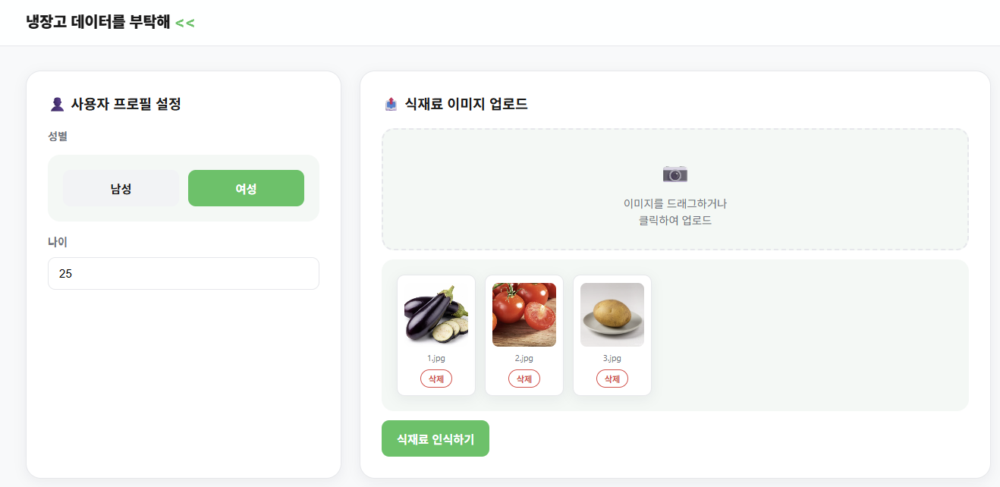
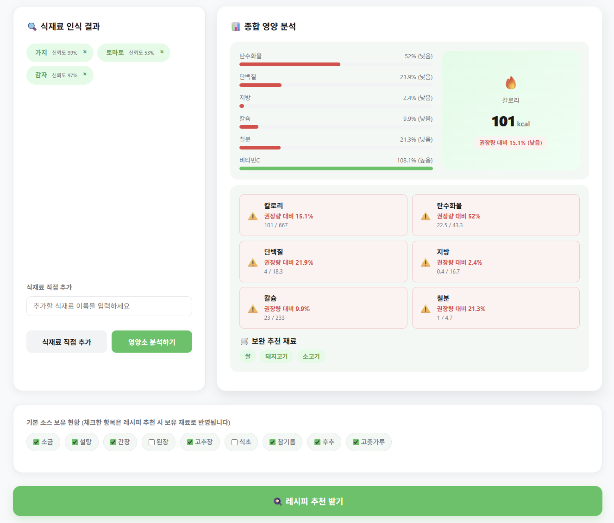
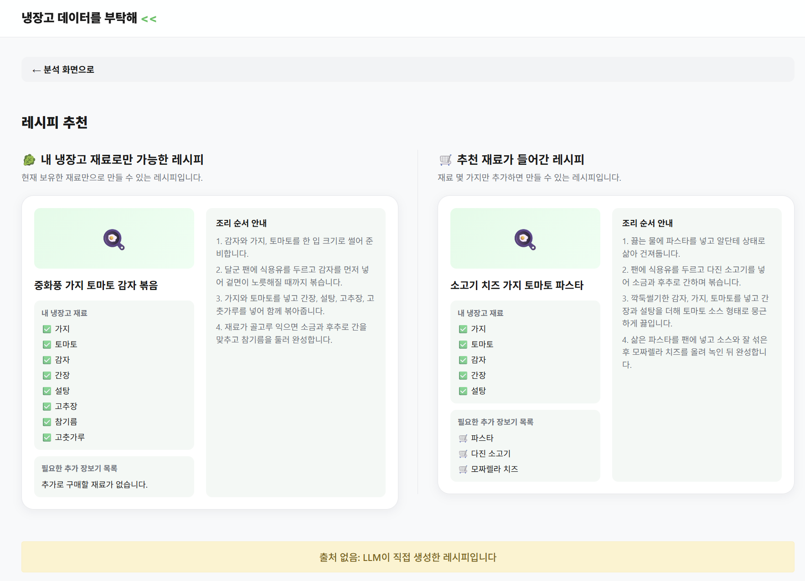

# 📄 중간보고서

> **팀명**: 잇(IT)다 | **프로젝트명**: 냉장고 데이터를 부탁해 — 식재료 데이터를 바탕으로 레시피 추천 서비스 제작하기

### 1. 프로젝트 소개

#### 1.1. 개발배경 및 필요성

통계청에 따르면 국내 1인 가구 비중은 2024년 기준 전체 가구의 35%를 넘었다. 1인 가구의 확산과 함께 식생활 문제도 심화되고 있는데, 1인 가구는 소량의 식재료를 구매하고도 냉장고 속 식재료를 잊어버려 낭비하거나 "무엇을 해먹을지 모르겠다"는 이유로 배달음식에 과도하게 의존하는 경향이 있다. 또한 건강에 대한 관심이 높아진 MZ세대를 중심으로 식단 내 영양소를 직접 관리하고자 하는 수요가 늘었지만, 기존 레시피 추천 서비스는 식재료를 일일이 텍스트로 입력해야 하거나 영양소 분석과 레시피 추천 기능이 분리되어 있어 사용자가 여러 서비스를 오가야 하는 불편함이 있다.

데이터 분석의 신뢰도를 위해 식품의약품안전처의 식품안전나라 식품영양성분 데이터베이스, 보건복지부·한국영양학회의 한국인 영양소 섭취기준(KDRIs), AI Hub의 한국 식재료 이미지 데이터셋 등 공공데이터를 기반으로 삼아 분석의 객관성과 모델 인식 정확도를 함께 확보하고자 하였다.

#### 1.2. 개발목표 및 주요내용

냉장고 속 식재료를 개별 촬영한 사진 여러 장을 업로드하면, 전이학습 모델이 각 식재료를 자동 분류하고 공공 영양소 DB와 연동하여 영양 정보를 보여주며, 생성형 AI를 통해 레시피를 추천하는 통합 웹 서비스를 개발하는 것을 최종 목표로 한다.

주요 기능은 다음 3가지이다.

- **식재료 이미지 분류**: EfficientNetB0 기반 전이학습 모델로 사진 속 식재료를 자동 인식 (Top-3 신뢰도 포함)
- **영양소 분석**: 식품안전나라 공공 DB와 KDRI 기준 대비 부족한 영양소(칼로리·단백질·비타민 등) 파악 및 보완 식재료 추천
- **레시피 추천**: 보유 식재료와 부족 영양소 정보를 LLM(gemini API)에 전달하여 "보유 재료 우선" 모드와 "영양 보완" 모드의 레시피를 각각 생성

#### 1.3. 세부내용

**요구사항 분석**

사용자는 프로필(성별·나이)을 입력한 뒤 냉장고 속 식재료를 하나씩 촬영한 여러 장의 이미지를 웹 페이지에 업로드한다. 업로드된 이미지는 전이학습 기반 이미지 인식 모델을 통해 식재료를 자동 식별해 목록으로 만들고, 잘못 인식된 식재료나 추가해야할 식재료가 있다면 직접 추가/삭제 할 수 있다. 확정된 식재료 목록은 [분석 시작] 버튼을 눌러야 영양 분석이 진행되며, 식품안전나라 데이터와 연계해 칼로리·탄수화물·단백질·지방·칼슘·철분·비타민C 등 영양 정보를 표와 그래프로 제공한다. 이후 [추천 시작] 버튼을 통해 보유 식재료와 부족 영양소를 생성형 AI에 전달하여 내 냉장고 속 재료만으로 가능한 레시피와 부족 영양소가 보완된 레시피 2가지를 추천한다.

**개발 환경**

Python을 기본 언어로 사용하며 딥러닝 모델 학습은 TensorFlow/Keras와 Google Colab GPU 환경에서 진행한다. 웹 백엔드는 FastAPI, 프런트엔드는 순수 HTML/CSS/JavaScript로 구현하며 레시피 생성에는 Gemini API(gemini-3.6-flash)를 사용한다. 코드 협업과 보고서 제출은 GitHub를 통해 진행하고 개발 전 과정에서 Claude code·GitHub Copilot 등 AI 코딩 도구와 Claude·ChatGPT·Gemini 등 생성형 AI를 코드 작성, 디버깅, 기능 구현에 활용하였다.

**제한사항 및 대책**

LLM이 레시피를 생성하는 과정에서 현실성이 낮은 조리법을 제안하거나 보유하지 않은 식재료를 필수 재료로 포함하는 할루시네이션이 발생할 수 있다. 이를 해결하기 위해 프롬프트 규칙으로 "보유 재료와 기본 양념(물·소금·후추·식용유)만 필수 재료로 가정하고, 밥·면·빵은 추가 재료로 분류하며 보유하지 않은 재료를 필수 재료로 만들지 않는다"는 지침을 명시하고, LLM 응답을 Pydantic 스키마로 강제 검증하여 입력에 없는 재료가 owned_ingredients에 포함되면 재시도하도록 설계하였다. 또한 LLM API 타임아웃·파싱 실패·빈 응답 상황에는 고정 Mock 응답으로 자동 폴백(fallback)하도록 구현해 서비스 중단을 방지하였다.

#### 1.4. 기존 서비스(상품) 대비 차별성

기존 식재료·레시피 서비스는 사용자가 보유 식재료를 직접 입력·선택해야 하는 번거로움이 있고, 범용 이미지 인식 모델을 사용해 깻잎·콩나물·두부 같은 한국 고유 식재료의 인식 정확도가 낮으며, 영양 분석과 레시피 추천 기능이 분리되어 있어 여러 서비스를 함께 이용해야 하는 한계가 있다.

본 프로젝트는 AI Hub의 한국 식재료 이미지 공공 데이터셋으로 EfficientNetB0을 직접 전이학습시켜 한국 식재료에 특화된 자체 분류 모델을 구축하였고, 텍스트 입력 대신 사진을 여러 장 한 번에 업로드해 일괄 인식하는 다중 이미지 처리 기능을 제공한다. 여기에 식품안전나라 공공 영양성분 데이터 기반 영양소 분석과 LLM 기반 레시피 추천을 하나의 웹 서비스에 통합하여, 별도 앱 설치 없이 브라우저에서 식재료 인식부터 레시피 확인까지 전 과정을 한 번에 경험할 수 있도록 하였다.

#### 1.5. 사회적가치 도입 계획

1인 가구 및 자취생의 식재료 낭비와 불균형한 식생활 문제를 데이터 기반으로 완화하는 것을 사회적 가치의 핵심으로 삼는다. 향후 지역사회·대학 커뮤니티 대상 시범 서비스를 통해 실제 사용성을 검증하고 실제 배포 가능한 수준으로 발전시키는 것을 목표로 한다. 특히 별도의 앱 설치 없이 브라우저에서 바로 이용할 수 있는 구조이기 때문에 자취생·1인 가구가 접근 장벽 없이 식재료 낭비 절감과 균형 잡힌 식생활 실천에 실질적으로 활용할 수 있는 서비스로 확장하는 것을 사회적 활용 방안으로 삼는다.

### 2. 상세설계

#### 2.1. 시스템 구성도

```
[프런트엔드: HTML/CSS/JS]
  ├─ 프로필 입력 · 이미지 업로드 · 인식 결과 수정
  ├─ 영양 분석 결과 렌더링
  └─ 레시피 카드 렌더링
        │  (REST API, JSON)
        ▼
[백엔드: FastAPI (main.py)]
  ├─ routers/health.py        — 서버 상태 확인
  ├─ routers/ingredients.py   — 이미지 인식 요청 처리
  ├─ routers/profile.py       — 프로필 기반 권장 섭취량 조회
  ├─ routers/nutrition.py     — 영양 분석 요청 처리
  └─ routers/recipes.py       — 레시피 추천 요청 처리
        │
        ▼
[서비스 계층]
  ├─ image_service.py    — EfficientNetB0 모델 로드·추론 (Top-3 신뢰도)
  ├─ nutrition_service.py — 영양 성분 조회 · KDRI 충족률 계산
  └─ llm_recipe_service.py — Claude API 호출, 보유재료/영양보완 레시피 생성 (Mock fallback)
        │
        ▼
[데이터 계층]
  ├─ model/artifacts/ingredient_model.keras, class_names.json
  ├─ data/nutrition.csv, kdri.csv, ingredient_aliases.json
  └─ backend/mock/recipe_mock.json (LLM 실패 시 폴백)
```

전체 흐름은 "프로필 입력 → 이미지 업로드 → 식재료 인식 → 인식 결과 수정/보완 → 영양 분석 → 레시피 추천"의 순서로 진행되며, 각 단계는 사용자가 직접 트리거(분석 시작·추천 시작 버튼)하는 구조로 설계하였다.

#### 2.3. 사용기술

| 이름 | 버전 / 비고 |
| --- | --- |
| Python | 3.x |
| FastAPI | 백엔드 API 서버 |
| Uvicorn | ASGI 서버 |
| Pydantic | 요청/응답 스키마 검증 |
| TensorFlow / Keras | EfficientNetB0 전이학습 |
| Google Colab (GPU) | 모델 학습 환경 |
| HTML / CSS / JavaScript | 프론트엔드 (프레임워크 없이 Vanilla JS) |
| Gemini API | gemini-3.6-flash, LLM 레시피 생성 |
| pytest | 단위 테스트 (영양 계산, 레시피 응답) |
| GitHub / GitHub Classroom | 협업 및 코드·보고서 관리 |
| Claude code, ChatGPT | AI 코딩 및 기획 보조 도구 |

### 3. 개발결과

#### 3.1. 전체시스템 흐름도

1. **프로필 입력** — 성별 토글, 나이 입력 → 개인 맞춤 하루 권장 섭취량 계산 기준 확정
2. **이미지 업로드** — 식재료를 개별 촬영한 이미지 여러 장을 다중 업로드 (jpg/jpeg/png)
3. **식재료 자동 인식** — EfficientNetB0 모델이 이미지별 Top-3 후보와 신뢰도 반환
4. **인식 결과 확인·수정** — [+ 직접 추가]로 누락 재료 보완, 삭제 시 사진·인식결과 동기화 삭제
5. **영양 분석** — [분석 시작] 클릭 시 확정된 재료 목록 기준으로 영양 성분 합산 및 KDRI 대비 충족률(%) 계산, 부족 영양소 경고 및 보완 식재료 후보 제시
6. **레시피 추천** — [추천 시작] 클릭 시 보유 재료·부족 영양소를 LLM에 전달, 내 냉장고 재료만으로 가능한 레시피와 영양소 보완 추천 레시피 (재료, 조리 단계) 생성

#### 3.2. 기능설명





| 기능 | 설명 |
| --- | --- |
| 성별·나이 입력 | 서비스 첫 진입 시 성별 토글과 나이 입력으로 개인 맞춤 권장 섭취량 계산 기준을 설정 |
| 식재료 자동 인식 + 신뢰도 표시 | 업로드한 사진마다 "두부로 인식했어요 (신뢰도 91%)" 형태로 식재료명과 신뢰도를 함께 표시 |
| 인식 결과 수정 UI | 신뢰도 70% 미만 항목에 한해 후보(candidates) 중 직접 선택하거나 텍스트로 수정 가능 |
| 식재료별 영양 성분 조회 | 100g 기준 칼로리·탄수화물·단백질·지방·칼슘·철분·비타민C를 표로 제공 |
| 부족 영양소 경고 및 보완 재료 추천 | KDRI 대비 충족률이 낮은 영양소를 경고 표시하고 보완 가능한 식재료 후보 상위 3개를 제시 |
| 식재료 삭제(동기화) | 업로드 사진 목록과 인식 결과 카드 중 어느 쪽에서 삭제해도 동일 재료가 양쪽에서 함께 삭제 |
| 식재료 직접 추가 | 인식되지 않았거나 잘못 인식된 재료를 텍스트로 직접 추가 |
| 보유 식재료 기반 레시피 추천 | 현재 보유한 재료만으로 조리 가능한 레시피를 LLM이 생성 |
| 영양 보완 레시피 추천 | 부족 영양소를 보완할 추가 재료를 포함한 레시피를 보유 재료(✅)/추가 필요 재료(🛒)로 구분해 제공 |
| 레시피 상세·조리 단계 안내 | 단계별 조리 순서를 리스트로 제공 |

#### 3.3. 기능명세서

| API | 메서드/경로 | 설명 |
| --- | --- | --- |
| 서버 상태 확인 | GET /api/health | `{"status": "ok"}` 반환 |
| 식재료 인식 | POST /api/ingredients/predict | 이미지(multipart) 업로드 → `{results: [{image_id, name, confidence, candidates, error}]}` 반환 |
| 식재료 검색 | GET /api/ingredients/search?query= | 별칭 사전 기반 문자열 포함 검색 후보 반환 |
| 권장 섭취량 조회 | POST /api/profile/recommendations | `{gender, age}` → KDRI 그룹별 권장 섭취량 반환 (범위 밖/미입력 시 400) |
| 영양 분석 | POST /api/nutrition/analyze | `{profile, ingredients}` → `{per_ingredient, summary(nutrient별 충족률), deficient_supplements}` 반환 |
| 레시피 추천 | POST /api/recipes/recommend | `{ingredients, deficient_nutrients, mode}` → `{recipe_mode:"llm", recipes:[{title, owned_ingredients, additional_ingredients, steps, reason, nutrition_reason, sources:[]}]}` 반환, 실패 시 Mock으로 폴백 |

공통 오류는 `{code, message, details}` 형태로 통일하여 반환하도록 설계하였다 (예: `INVALID_PROFILE`, `EMPTY_INGREDIENTS`, `MODEL_NOT_LOADED`, `RECIPE_API_ERROR`).

#### 3.4. 디렉토리 구조

```
project/
├── frontend/
│   ├── index.html
│   ├── css/style.css
│   └── js/
│       ├── state.js        # 전역 상태 관리
│       ├── upload.js       # 이미지 업로드·인식 결과 처리
│       ├── nutrition.js    # 영양 분석 화면
│       ├── recipes.js      # 레시피 추천 화면
│       ├── app.js          # 초기화·공통 오류 처리
│       └── api.js          # 백엔드 API 호출
├── backend/
│   ├── main.py             # FastAPI 앱, 라우터 등록, 공통 예외처리
│   ├── config.py           # 환경설정 (.env 로드)
│   ├── services/
│   │   ├── image_service.py
│   │   ├── nutrition_service.py
│   │   └── llm_recipe_service.py
│   ├── routers/
│   │   ├── health.py
│   │   ├── ingredients.py
│   │   ├── profile.py
│   │   ├── nutrition.py
│   │   └── recipes.py
│   ├── schemas/
│   │   └── recipe.py
│   └── mock/
│       └── recipe_mock.json
├── model/
│   ├── notebooks/train_efficientnet.ipynb
│   ├── artifacts/ingredient_model.keras
│   ├── artifacts/class_names.json
│   └── evaluation/
├── data/
│   ├── nutrition.csv
│   ├── kdri.csv
│   └── ingredient_aliases.json
├── tests/
│   ├── test_nutrition.py
│   ├── test_image_service.py
│   ├── test_api_integration.py
│   └── test_recipes.py
├── docs/
│   ├── nutrition_manual_check.md
│   ├── api_contract.md
│   └── recipe_handover.md
├── .env.example
└── README.md
```

### 4. 이후 고도화 시킬 내용

- **재료 추가 학습**: 현재 6가지 재료만 식별가능한 모델을 추가 학습을 통해 인식 가능 식재료 수를 확대할 예정
- **RAG 기반 레시피 검색 도입**: 7월 MVP의 LLM 직접 생성 방식에서 나아가, 실제 레시피 문서를 검색·인용하는 RAG 구조를 도입해 보다 설득력 있고 근거 있는 레시피를 생성하도록 고도화
- **재료 그람 수 수정 기능**: 현재는 재료를 100g 기준으로 일괄 가정하고 있어, 사용자가 실제 보유량(그람 수)을 직접 입력·수정할 수 있도록 하여 영양 분석의 정확도를 높임
- **모바일 지원**: 반응형 UI를 넘어 실제 모바일 환경(카메라 촬영 연동 등)에서도 원활하게 서비스를 이용할 수 있도록 지원 확대

> 위 4가지 고도화 항목은 8월 개발 기간 동안 모두 완료되었다. 최종 결과는 저장소 루트의 `README.md`(최종보고서)를 참고한다.
